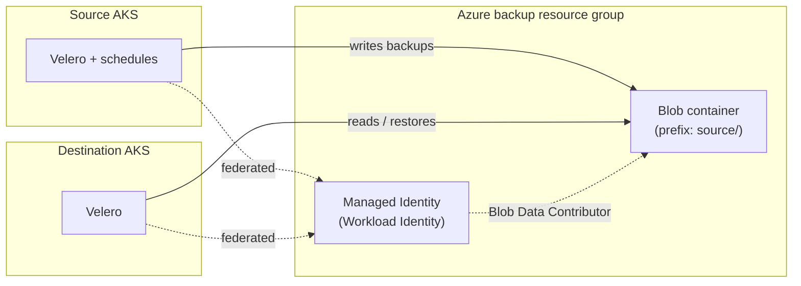

# AKS Backup & Restore with Velero (Terraform)

Production-ready Terraform that installs [Velero](https://velero.io/) on two Azure Kubernetes Service (AKS) clusters and wires them to a shared, secured Azure Blob backup store. The **source** cluster backs up; the **destination** cluster restores. Authentication is **passwordless** via **Azure Workload Identity** — no keys or secrets in code or state.



## Documentation

Start here based on what you need:

| I want to… | Go to |
|------------|-------|
| Deploy from scratch, step by step | [docs/GETTING_STARTED.md](docs/GETTING_STARTED.md) |
| Understand the design & diagrams | [docs/ARCHITECTURE.md](docs/ARCHITECTURE.md) · [editable draw.io](docs/diagrams/README.md) |
| Run backups & restores (incl. beginner walkthrough) | [docs/BACKUP_RESTORE.md](docs/BACKUP_RESTORE.md) |
| Test with a demo app (all object types) | [examples/sample-app](examples/sample-app/README.md) |
| Fix an error | [docs/TROUBLESHOOTING.md](docs/TROUBLESHOOTING.md) |
| Tear everything down | [docs/CLEANUP.md](docs/CLEANUP.md) |
| Details of a specific module | `modules/*/README.md` |

## What it does

1. Optionally creates two cost-optimized AKS clusters (Free tier, autoscaling, Azure CNI Overlay, OIDC + Workload Identity).
2. Creates a hardened storage account + private blob container for backups.
3. Creates a user-assigned managed identity with least-privilege blob access and federates it to each cluster's Velero service account (passwordless).
4. Installs Velero on both clusters via Helm, with a `VolumeSnapshotClass` for CSI PV snapshots.
5. Creates backup schedules on the source; the destination reads the same storage to restore.

## Project structure

```text
.
├── docs/                       # Guides + diagrams (see table above)
├── modules/                    # aks-cluster, azure-storage, velero-source/destination/restore
├── examples/                   # sample-app (all object types) + VolumeSnapshotClass
├── chart/                      # Optional vendored Velero chart (offline fallback)
├── scripts/                    # validate.sh, backup.sh, restore.sh, cleanup.sh
├── main.tf  variables.tf  outputs.tf  providers.tf  versions.tf
└── terraform.tfvars.example
```

## Quick start

```bash
# 0. Pre-flight checks (tools + Azure login)
./scripts/validate.sh

# 1. Configure
cp terraform.tfvars.example terraform.tfvars   # then edit subscription_id, tenant_id, cluster names

# 2. Deploy
terraform init
terraform apply

# 3. Connect kubectl to the clusters
az aks get-credentials -g rg-aks-source      -n aks-source
az aks get-credentials -g rg-aks-destination -n aks-destination

# 4. Confirm Velero is healthy
kubectl -n velero get pods
velero backup-location get -n velero        # expect PHASE = Available
```

Then follow the [beginner walkthrough](docs/BACKUP_RESTORE.md#beginner-walkthrough-first-manual-backup--restore) for your first backup and restore.

> **Prerequisites:** Terraform ≥ 1.5, Azure CLI ≥ 2.55, kubectl ≥ 1.27, Helm ≥ 3.12, velero CLI ≥ 1.14, and an Azure login with rights to create the resources. Full details in [docs/GETTING_STARTED.md](docs/GETTING_STARTED.md).

## Key inputs

Full list and types are in [`variables.tf`](variables.tf); a copyable example is in [`terraform.tfvars.example`](terraform.tfvars.example).

| Variable | Default | Description |
|----------|---------|-------------|
| `subscription_id` / `tenant_id` | — | Azure identity (required). |
| `location` | `eastus` | Region for backup storage. |
| `create_clusters` | `true` | Create the AKS clusters, or reuse existing ones. |
| `source_cluster` / `destination_cluster` | — | `{name, resource_group_name, location?}`. |
| `cluster_config` | cost-optimized | Created-cluster sizing & networking (see below). |
| `blob_container_name` | `velero` | Shared backup container. |
| `storage_account_replication_type` | `ZRS` | LRS/ZRS/GRS/… |
| `velero_helm_chart_version` | `12.1.0` | Chart 12.x installs Velero v1.16. |
| `velero_image_tag` | `v1.16.0` | Velero server version. |
| `velero_plugin_azure_tag` | `v1.12.0` | Must be a published tag matching the Velero version. |
| `enable_csi_snapshots` | `true` | CSI PV snapshots (creates the `VolumeSnapshotClass`). |
| `enable_node_agent` | `false` | Kopia filesystem backups. |
| `backup_schedules` | one `daily` | Scheduled backups (cron, filters, ttl). |
| `use_local_chart` | `false` | Install Velero from a vendored chart ([chart/README.md](chart/README.md)). |

### `cluster_config` (created clusters)

| Field | Default | Notes |
|-------|---------|-------|
| `sku_tier` | `Free` | No uptime-SLA charge. |
| `node_vm_size` | `Standard_D2als_v7` | 2 vCPU. Some subscriptions restrict sizes. |
| `enable_auto_scaling` / `min`/`max_node_count` | `true` / `1` / `2` | Scales to 1 node when idle. |
| `os_disk_size_gb` | `32` | Small disk for cost. |
| `pod_cidr` / `service_cidr` / `dns_service_ip` | `10.244.0.0/16` / `10.0.0.0/16` / `10.0.0.10` | Azure CNI Overlay. |

> **Networking:** uses **Azure CNI Overlay** — kubenet is deprecated and unsupported after 2028-03-31.
> **No secrets:** the managed identity is passwordless; outputs expose only its client/principal ID.

## Security highlights

- Passwordless Workload Identity — no storage keys anywhere.
- Storage account: TLS 1.2, public blob access disabled, infrastructure encryption, soft-delete + versioning.
- Role assignment scoped to the storage account (least privilege).
- For production: set `storage_network_default_action = "Deny"` (or Private Endpoints), consider a CMK, and restrict access to Terraform state.

## Cost notes

Tuned for low cost in dev/demo/DR: Free control-plane tier, a single small autoscaling node per cluster, small OS disks, and `ttl`-based backup expiry. Revisit sizing, `sku_tier`, replication, and retention for production. Full breakdown in [docs/ARCHITECTURE.md](docs/ARCHITECTURE.md) and inline comments.

## Cleanup

```bash
./scripts/cleanup.sh --velero      # remove Velero from the current cluster
./scripts/cleanup.sh --all         # backups + Velero (both clusters) + terraform destroy
```

See [docs/CLEANUP.md](docs/CLEANUP.md) for staged teardown and gotchas.

## Assumptions & limitations

- Clusters can be created here or reused (`create_clusters`); created ones are dev-sized — resize for production.
- One shared storage account/container so the destination can read source backups; same tenant, single (or role-reachable cross-) subscription.
- Velero `Restore` objects are one-shot — use `scripts/restore.sh` or the rendered manifest to repeat.
- PV restore fidelity depends on matching StorageClasses/CSI drivers between clusters.
- Provider pins: `azurerm ~> 4.0`, `helm ~> 2.13`, `kubernetes ~> 2.30`.
