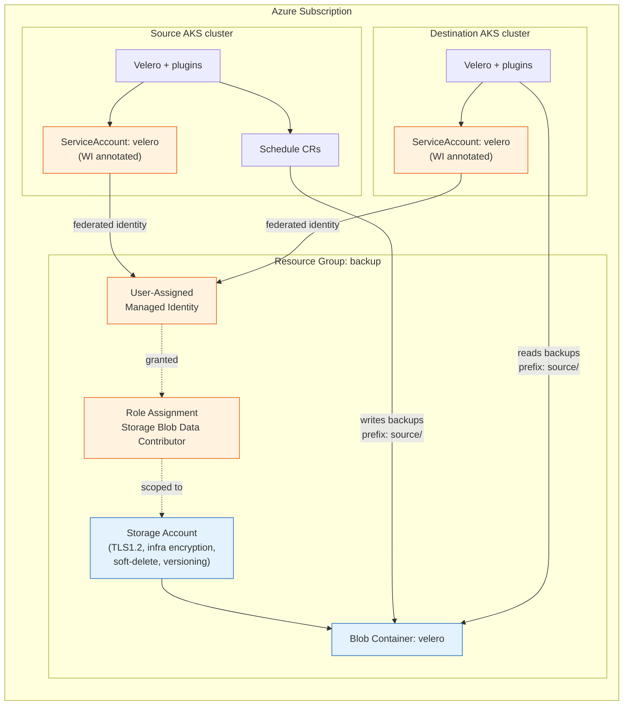
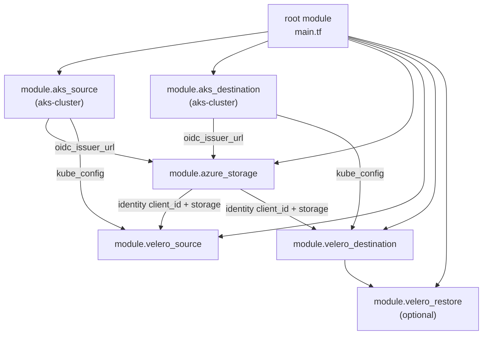
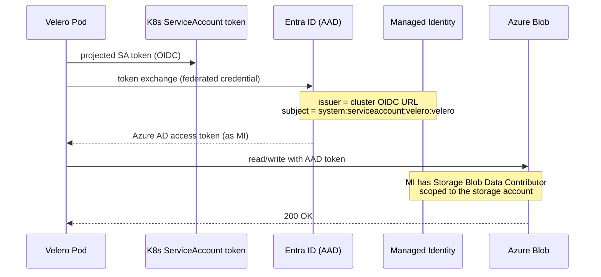
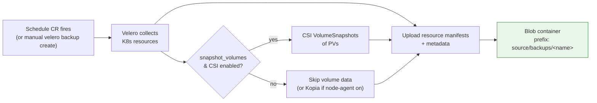
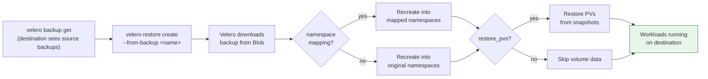
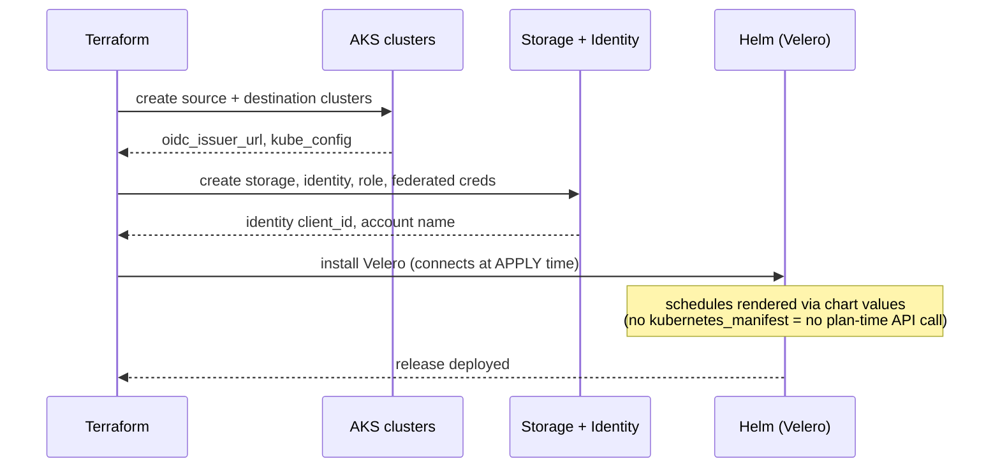

# Architecture

This document explains how the pieces fit together. Diagrams below use [Mermaid](https://mermaid.js.org/) (renders inline on GitHub). Editable **draw.io** versions of the main diagrams live in [docs/diagrams/](./diagrams/README.md) for polished exports.

- [System overview](#system-overview)
- [Terraform module dependency graph](#terraform-module-dependency-graph)
- [Passwordless authentication (Workload Identity)](#passwordless-authentication-workload-identity)
- [Backup flow](#backup-flow)
- [Restore flow](#restore-flow)
- [Apply-time ordering](#apply-time-ordering)

---

## System overview

One shared Azure Blob container is written to by the **source** cluster and read by the **destination** cluster. Both authenticate passwordlessly to the same user-assigned managed identity via Azure Workload Identity.

---

## Terraform module dependency graph

How the root module wires the child modules together.

The clusters' OIDC issuer URLs feed the storage module (to create federated credentials), and the storage module's identity + account details feed both Velero installs. `create_clusters = false` swaps the two `aks-*` modules for `azurerm_kubernetes_cluster` data-source lookups; everything downstream is unchanged because it reads normalized `locals`.

---

## Passwordless authentication (Workload Identity)

No storage keys or secrets are stored anywhere. A Velero pod exchanges its Kubernetes service-account token for an Azure AD token, which grants blob access.

---

## Backup flow

Backups land under `source/backups/<backup-name>/` in the shared container. Each schedule has its own `ttl`, so old backups expire automatically.

---

## Restore flow

The destination cluster reads the same prefix, so the source's backups are visible there.

---

## Apply-time ordering

Why a single `terraform apply` works even when the clusters are created in the same run.

The key design choice: backup schedules are rendered through the Velero **Helm chart values**, not the `kubernetes_manifest` resource. `kubernetes_manifest` needs a live cluster API at *plan* time, which does not exist yet when the clusters are created in the same run. Helm connects at *apply* time, after the clusters exist.
